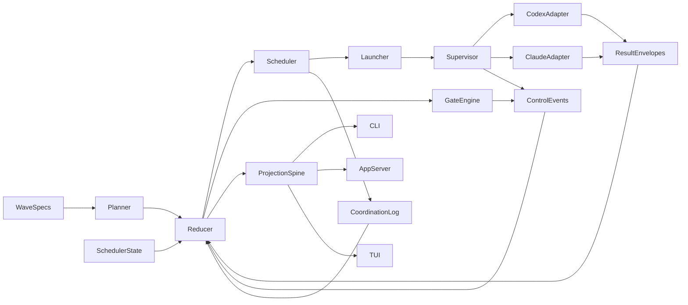

# Parallel-Wave Multi-Runtime Architecture

This document is the updated architecture target for the Wave Rust rewrite when judged as the foundation for a better multi-agent coding harness with true parallel waves.

It is intentionally architecture-first.

It does **not** claim that the current Rust repo already ships this end state.

For live behavior today, read:

- [rust-codex-refactor.md](./rust-codex-refactor.md)
- [../plans/current-state.md](../plans/current-state.md)
- [../reference/runtime-config/README.md](../reference/runtime-config/README.md)

For the broader 0.2 cutover architecture that this document extends, read:

- [rust-wave-0.2-architecture.md](./rust-wave-0.2-architecture.md)
- [rust-wave-0.3-notes.md](./rust-wave-0.3-notes.md)
- [../plans/full-cycle-waves.md](../plans/full-cycle-waves.md)

## Architectural Readout

The current Rust repo is a stronger architectural base than the older launcher-centered system because it already separates:

- typed domain state
- control events
- coordination records
- reducer logic
- projections
- result envelopes
- app-server snapshots
- TUI rendering

That is the right direction.

The main gap is runtime behavior. The live runtime is still effectively:

- one selected wave at a time
- one agent at a time
- Codex-only
- readiness-driven rather than lease-driven

So the target architecture should not be “make the current launcher slightly smarter.”

It should be:

**a reducer-backed, scheduler-led, multi-runtime harness with real parallel waves and a shared abstraction for planning, skills, coordination, and closure.**

More specifically, it should be a **full-cycle harness**:

- design/spec/product loops first
- implementation second
- hardening, integration, QA, and rollout after

The system should not treat every wave as “implementation with a different prompt.” It should support different wave classes with different closure expectations on one shared substrate.

## Design Rules

## 1. Keep one global control-plane model

The repo should have one semantic control-plane model above any runtime choice.

That model should own:

- wave declarations
- task graph and dependencies
- facts
- contradictions
- human-input requests
- gates
- result envelopes
- claims and leases
- queue state
- closure state

Codex and Claude should not change those semantics. They should only change how work is executed at the edge.

## 2. Treat planning as a first-class layer

The system needs a global abstraction for planning that is richer than prompt compilation.

Planning should own:

- wave/task synthesis from `waves/*.md`
- architecture sections in scope
- invariants to preserve
- staged gate expectations
- retry and reuse policy intent
- skill intent before runtime projection

This keeps authored waves meaningful across runtimes and across execution retries.

Planning also needs to understand the full-cycle wave model from `docs/plans/full-cycle-waves.md`, not only implementation slices. That means planning should be able to produce and track:

- design loops
- synthesis gates
- implementation-ready packets
- post-implementation hardening and rollout work

## 3. Treat skills as governed artifacts, not prompt fragments

The live repo already treats skills as explicit authored-wave inputs. The target architecture should preserve that but add one more rule:

- skills are declared at the wave/role/subsystem level first
- runtime-specific overlays are applied only after executor resolution

That gives one shared abstraction for skills across Codex and Claude:

- same semantic skill intent
- different runtime overlays at the adapter edge

## 4. Make scheduling authoritative

Parallel waves cannot be safely implemented as “pick the next ready wave faster.”

The harness needs a scheduler that owns:

- wave claims
- task leases
- lease renewal and expiry
- concurrency budgets
- fairness and starvation handling
- parallel-wave admission
- downstream unlock rules
- reopen/retry routing

Without that, the system remains a serial queue runner with better docs.

## 5. Keep reducers and projections separate

The reducer should compute current truth.

Projections should render:

- queue rows
- control status
- dashboard/TUI data
- trace summaries
- proof summaries
- operator actions

The TUI, CLI, and app-server should remain consumers of that projection spine.

## The Intended End-State Model

## Full-Cycle Wave Model

The harness should support three broad categories of work on the same substrate:

1. design loops
2. implementation waves
3. post-implementation closure and hardening

This is the key alignment with `docs/plans/full-cycle-waves.md`.

## Wave classes

The target architecture should support first-class wave classes such as:

- `spec`
- `architecture`
- `product_design`
- `implementation`
- `integration`
- `verification`
- `hardening`
- `rollout`

These are not just labels for prompts. They imply different success criteria, gate families, and scheduling behavior.

## Wave intents

The planner should be able to distinguish intent such as:

- `explore`
- `converge`
- `implement`
- `verify`
- `close`

This lets the scheduler treat design convergence differently from implementation execution.

## Wave loop policy

Pre-implementation waves should support explicit loop policy rather than informal replanning:

- maximum loop count
- contradiction threshold
- open-question threshold
- completeness threshold
- human-review requirement

That is how the harness turns design iteration into durable control-plane state.

## Full-cycle phases

In practice, the harness should be able to move through phases like:

- design loop
- design closure
- implementation
- integration
- verification
- hardening
- complete

This gives the reducer and scheduler a better model than a flat planned/running/completed progression.

## Authority Layers

## Canonical

The canonical authority set should be:

- `waves/*.md`
- control events
- coordination records
- result envelopes
- scheduler claim and lease state

Those are the semantic roots.

## Derived

These should remain projections or rebuildable caches:

- queue summaries
- dashboards
- TUI view state
- compiled prompt bundles
- replay summaries
- trace summaries
- proof summaries
- retry plans

This keeps the system replayable and prevents a launcher artifact from becoming hidden authority.

## Runtime Abstraction

## Shared runtime contract

The same wave contract and reducer state should be able to drive:

- Codex
- Claude

without changing:

- task graph semantics
- closure order
- contradiction handling
- gate semantics
- result-envelope structure
- operator truth

That requires a shared executor contract with:

- launch spec
- capability model
- artifact expectations
- failure classification
- fallback metadata

## Runtime-specific edges

Codex- and Claude-specific behavior should live only in adapters:

- command invocation
- environment and runtime files
- system-prompt overlays
- runtime-native configuration
- runtime-specific skill overlays
- artifact collection

This keeps runtime plurality from leaking into the declaration model.

## Scheduler And Lease Model

## Why leases matter

The current Rust domain already hints at this with `TaskState::Leased`, but true parallel waves require a fully explicit claim and lease protocol.

The harness should model:

- `wave_claim`
- `task_lease`
- `lease_owner`
- `lease_expiry`
- `lease_heartbeat`
- `lease_conflict`
- `lease_release`

## Why claims are different from readiness

Readiness answers:

- can this wave run?

Claims answer:

- who owns it right now?

The current repo mostly computes the first. A real scheduler needs both.

## Admission rules for true parallel waves

A wave should only become active in parallel if:

- dependencies are satisfied
- no exclusive ownership overlap exists
- no unresolved contradiction or required human-input gate blocks it
- scheduler budget allows it

Within a wave, tasks should only run in parallel if:

- their ownership slices do not conflict
- their declared dependencies allow parallel execution
- closure roles are not prematurely started

Design/spec/product tasks may run in parallel where ownership and artifacts do not overlap. Synthesis, integration, documentation, QA, and rollout closure remain phase-gated.

## Result And Gate Model

The current result-envelope direction is correct, but it should be generalized beyond marker-driven closure.

Result envelopes should become the machine-readable input for:

- proof state
- doc delta
- integration evidence
- contradiction references
- human-input references
- gate evaluation

Gates should include:

- owned-slice proof
- integration readiness
- documentation closure
- cont-QA closure
- contradiction blocking
- human-input blocking
- ownership/parallel-safety checks

## Result envelopes for non-code waves

Full-cycle waves need machine-readable outputs even when the result is not code.

The architecture should therefore support role-aware payloads such as:

- `SpecResult`
  requirements, assumptions, decisions, open questions, referenced artifacts
- `ArchitectureResult`
  components defined, interfaces defined, migrations, risks, implementation slices unlocked
- `ProductDesignResult`
  journeys covered, error states covered, operator workflows, unresolved questions

This prevents the reducer from having to infer design completeness from markdown and ad hoc closure prose alone.

## Questions, decisions, and contradictions

The full-cycle model also needs stronger durable state for upstream ambiguity.

Beyond facts and contradictions, the control-plane should be able to represent:

- open questions
- assumptions
- decisions
- superseded decisions

Whether that becomes a dedicated `QuestionRecord` or a stronger coordination subtype, the important point is the same: implementation-discovered ambiguity must reopen the right design wave through durable workflow state rather than informal notes.

## Gate families by phase

The architecture should distinguish gate families rather than treating all gates as implementation closure:

- design gates
  completeness, contradiction, traceability, implementation readiness
- implementation gates
  owned-slice proof, artifact proof, integration dependency
- closure gates
  integration, documentation, QA, rollout
- parallel-safety gates
  ownership conflict, shared-artifact contention, lease validity

## Planning And Skills As Shared Global Abstractions

This harness needs one abstraction layer for planning and one for skills that survives runtime changes.

## Planning abstraction

Planning should produce:

- stable task packets
- invariants
- required gates
- dependency edges
- ownership slices
- escalation expectations

It should not be runtime-specific.

## Skill abstraction

Skill intent should be declared before runtime resolution:

- role skill
- subsystem skill
- repo operating rules
- closure discipline

Then runtime projection should happen after executor choice:

- Codex overlay
- Claude overlay

This is the right place to share one planning/skills model across both runtimes.

## End-to-End Full-Cycle Flow

The intended flow should look like this:

1. an initiative is declared with design-first intent
2. the scheduler admits parallel design waves such as spec, architecture, product, and ops where ownership allows it
3. the reducer tracks facts, decisions, contradictions, questions, and design completeness
4. a synthesis gate produces implementation-ready packets with ownership and acceptance criteria
5. implementation waves run in parallel where dependencies, ownership, and budget allow it
6. integration, verification, QA, docs, and rollout-hardening close the loop
7. if implementation exposes ambiguity, the scheduler reopens the relevant upstream design wave and blocks or degrades dependent work accordingly

That is the difference between a multi-agent coding harness and a full-cycle multi-agent delivery harness.

## Operator Surfaces In The Full-Cycle Model

The TUI and app-server should stay thin, but the architecture should anticipate richer operator visibility than the current bootstrap shell.

Useful full-cycle operator surfaces include:

- portfolio
- wave
- tasks
- questions
- contradictions
- leases
- proof
- control

Useful full-cycle operator actions include:

- claim or release wave
- pause or resume wave
- reopen design loop
- escalate question
- approve decision
- force reroute
- change priority
- inspect overlap or contention
- admit downstream implementation waves

These remain projection-driven control actions, not local planning logic inside the TUI.

## Current-State Gap Summary

The Rust repo already has the right bones:

- typed domain model
- canonical event roots
- reducer/projection split
- thin app-server
- thin TUI

The live behavior still falls short in four ways:

1. the runtime is serial
2. durable claims and leases are not yet the active scheduler truth
3. multi-runtime execution is not yet live in Rust
4. the domain is richer than the runtime currently exercises
5. the live harness is still implementation-first operationally, not yet a true full-cycle design-to-hardening system

## Non-Goals

This architecture target does not require:

- turning the TUI into a planner
- making a hosted service authoritative
- changing wave semantics per runtime
- preserving package-era ergonomics as the main design goal

It also should not treat compatibility as the main product concern for this document. The goal is a better harness foundation.

## Recommended Cutover Framing

The repo should describe the path forward in this order:

1. repair research and architecture docs so live and target-state boundaries are explicit
2. align the target architecture with the full-cycle wave model so design/spec/product loops, implementation, and hardening all live on the same substrate
3. document the scheduler-plus-lease model as the missing foundation for parallel waves
4. split launcher, supervisor, and executor concerns in the architecture
5. document Codex and Claude as sibling adapters behind one runtime-neutral planner/reducer model
6. document late-bound runtime skill projection as the shared abstraction for planning and skills
7. keep post-slice gates and targeted retry as mandatory design rules for future runtime work

## Validation And Proof Expectations

The repo should not claim the intended harness is landed until the docs and evidence can support all of the following:

- the same wave contract can be explained against both Codex and Claude without changing planner or reducer semantics
- scheduler state is documented as durable claim and lease state rather than inferred from readiness alone
- parallel-wave admission rules are explicit about dependencies, ownership overlap, and concurrency budget
- result envelopes and gates are documented as the machine-readable closure path
- docs clearly distinguish current live behavior from target-state architecture

Useful proof categories for the later implementation work should include:

- reducer and projection parity
- scheduler claim and lease replayability
- adapter parity between Codex and Claude
- post-slice gate evidence
- targeted retry evidence
- operator-surface parity across CLI, app-server, and TUI

Until those proofs exist, this document should be read as target-state architecture rather than current runtime description.

## Bottom Line

The right architectural target is not:

**a nicer serial Codex launcher**

It is:

**a reducer-backed multi-agent harness with real scheduler authority, real parallel waves, and one global abstraction for planning, skills, and coordination above Codex and Claude runtime adapters.**

That is the strongest long-term use of the architecture already taking shape in this repository.
