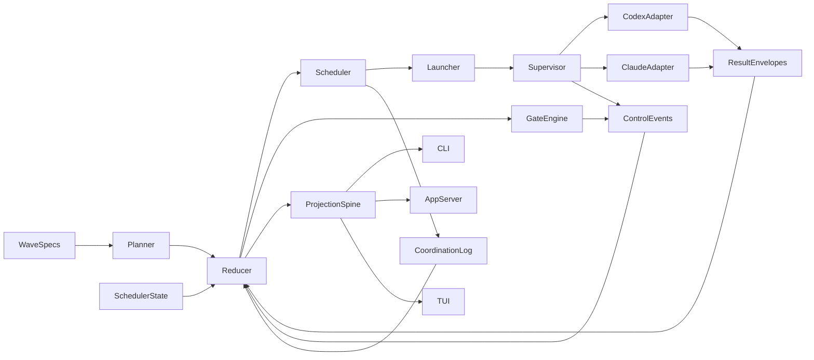

# Parallel-Wave Multi-Runtime Architecture

This document is the updated architecture target for the Wave Rust rewrite when judged as the foundation for a better multi-agent coding harness with true parallel waves.

It is intentionally architecture-first.

It does **not** claim that the current Rust repo already ships this end state.

It now stops at the parallel-wave boundary. True concurrent agents inside one wave are covered separately in:

- [true-multi-agent-wave-architecture.md](./true-multi-agent-wave-architecture.md)
- [../plans/true-multi-agent-wave-rollout.md](../plans/true-multi-agent-wave-rollout.md)

For live behavior today, read:

- [rust-codex-refactor.md](./rust-codex-refactor.md)
- [../plans/current-state.md](../plans/current-state.md)
- [../reference/runtime-config/README.md](../reference/runtime-config/README.md)
- [./live-proofs/phase-2-parallel-wave-execution/README.md](./live-proofs/phase-2-parallel-wave-execution/README.md)

For the broader 0.2 cutover architecture that this document extends, read:

- [rust-wave-0.2-architecture.md](./rust-wave-0.2-architecture.md)
- [rust-wave-0.3-notes.md](./rust-wave-0.3-notes.md)
- [../plans/full-cycle-waves.md](../plans/full-cycle-waves.md)

For the detailed target-state design for true concurrent agents inside one wave, read:

- [true-multi-agent-wave-architecture.md](./true-multi-agent-wave-architecture.md)

## Wave 14 And Wave 15 Live Boundary

Wave 14 and Wave 15 now define the honest repo-local execution boundary.

What is live now:

- repo-local parallel admission and execution for two non-conflicting waves at a time
- one isolated worktree per active wave under `.wave/state/worktrees/`
- one shared wave-local filesystem view for every agent inside the same wave
- a runtime-neutral adapter registry in `wave-runtime`
- explicit runtime selection and fallback records persisted in run state, structured results, and operator transport
- Codex and Claude as sibling adapters behind that shared runtime boundary
- runtime-aware skill projection resolved from the selected wave-local execution root after final runtime selection and fallback
- app-server run-detail transport now carries the same execution state surfaced in reducer-backed wave projections
- explicit promotion state before closure, with `promotion.ready` gated by a scratch merge validation against the current target snapshot and conflict or failure blocking closure
- released worktrees are actually removed before the runtime records `state=released`
- reducer-backed projection visibility for worktree identity, promotion state, merge blocking, scheduler wait reasons, reserved closure capacity, and preemption evidence

What is still later work:

- a richer runtime policy engine and operator policy controls
- more runtimes beyond Codex and Claude
- hosted or richer portfolio-delivery policy above the now-landed repo-local delivery layer
- decision, contradiction, and invalidation lineage
- true concurrent intra-wave MAS execution with per-agent sandboxes, merge queue authority, and invalidation control

## Architectural Readout

The current Rust repo is a stronger architectural base than the older launcher-centered system because it already separates:

- typed domain state
- control events
- coordination records
- reducer logic
- projections
- result envelopes
- app-server snapshots
- TUI rendering

That is the right direction.

The main remaining gap is richer runtime policy breadth above the landed adapter seam. The live runtime is now:

- parallel for up to two non-conflicting repo-local waves at a time
- one agent at a time inside each wave, sharing that wave's worktree
- runtime-neutral at the boundary with Codex and Claude adapters
- scheduler-enforced and lease-aware, with FIFO fairness inside claimable implementation admission plus reserved closure capacity and lease-level preemption above that lane, but still not yet a multi-runtime policy engine

So the target architecture should not be “make the current launcher slightly smarter.”

It should be:

**a reducer-backed, scheduler-led, multi-runtime harness with real parallel waves and a shared abstraction for planning, skills, coordination, and closure.**

More specifically, it should be a **full-cycle harness**:

- design/spec/product loops first
- implementation second
- hardening, integration, QA, and rollout after

The system should not treat every wave as “implementation with a different prompt.” It should support different wave classes with different closure expectations on one shared substrate.

## Design Rules

## 1. Keep one global control-plane model

The repo should have one semantic control-plane model above any runtime choice.

That model should own:

- wave declarations
- task graph and dependencies
- facts
- contradictions
- human-input requests
- gates
- result envelopes
- claims and leases
- queue state
- closure state

Codex and Claude should not change those semantics. They should only change how work is executed at the edge.

## 2. Treat planning as a first-class layer

The system needs a global abstraction for planning that is richer than prompt compilation.

Planning should own:

- wave/task synthesis from `waves/*.md`
- architecture sections in scope
- invariants to preserve
- staged gate expectations
- retry and reuse policy intent
- skill intent before runtime projection

This keeps authored waves meaningful across runtimes and across execution retries.

Planning also needs to understand the full-cycle wave model from `docs/plans/full-cycle-waves.md`, not only implementation slices. That means planning should be able to produce and track:

- design loops
- synthesis gates
- implementation-ready packets
- post-implementation hardening and rollout work

## 3. Treat skills as governed artifacts, not prompt fragments

The live repo already treats skills as explicit authored-wave inputs. The target architecture should preserve that but add one more rule:

- skills are declared at the wave/role/subsystem level first
- runtime-specific overlays are applied only after executor resolution
- the projected runtime skill set must be read from the same wave-local execution root that the selected runtime actually executes

That gives one shared abstraction for skills across Codex and Claude:

- same semantic skill intent
- different runtime overlays at the adapter edge

## 4. Make scheduling authoritative

Parallel waves cannot be safely implemented as “pick the next ready wave faster.”

The harness needs a scheduler that owns:

- wave claims
- task leases
- lease renewal and expiry
- concurrency budgets
- fairness and starvation handling
- parallel-wave admission
- downstream unlock rules
- reopen/retry routing

Without that, the system remains a serial queue runner with better docs.

## 5. Keep reducers and projections separate

The reducer should compute current truth.

Projections should render:

- queue rows
- control status
- dashboard/TUI data
- trace summaries
- proof summaries
- operator actions

The TUI, CLI, and app-server should remain consumers of that projection spine.

## 6. Isolate execution per active wave

True parallel implementation waves need filesystem isolation.

The live and near-term isolation unit should be:

- one worktree per active parallel wave

Agents participating in the same wave should share that wave-local worktree so they are collaborating on one coherent wave state, while different active waves stay isolated from one another.

That implies the target architecture needs:

- a wave-scoped worktree/workspace manager
- wave-local temp state and artifacts
- explicit merge and integration handling back into the main line
- conflict detection before closure

Without wave-level workspace isolation, true parallel waves are operationally unsafe even if claims and leases exist on paper.

This section describes the active parallel-wave boundary only. The later true-MAS architecture adds per-agent sandboxes inside the admitted wave while retaining the wave-scoped integration lineage. See [true-multi-agent-wave-architecture.md](./true-multi-agent-wave-architecture.md).

## The Intended End-State Model

## Full-Cycle Wave Model

The harness should support three broad categories of work on the same substrate:

1. design loops
2. implementation waves
3. post-implementation closure and hardening

This is the key alignment with `docs/plans/full-cycle-waves.md`.

## Wave classes

The target architecture should support first-class wave classes such as:

- `spec`
- `architecture`
- `product_design`
- `implementation`
- `integration`
- `verification`
- `hardening`
- `rollout`

These are not just labels for prompts. They imply different success criteria, gate families, and scheduling behavior.

## Wave intents

The planner should be able to distinguish intent such as:

- `explore`
- `converge`
- `implement`
- `verify`
- `close`

This lets the scheduler treat design convergence differently from implementation execution.

## Wave loop policy

Pre-implementation waves should support explicit loop policy rather than informal replanning:

- maximum loop count
- contradiction threshold
- open-question threshold
- completeness threshold
- human-review requirement

That is how the harness turns design iteration into durable control-plane state.

## Full-cycle phases

In practice, the harness should be able to move through phases like:

- design loop
- design closure
- implementation
- integration
- verification
- hardening
- complete

This gives the reducer and scheduler a better model than a flat planned/running/completed progression.

## Authority Layers

## Canonical

The canonical authority set should be:

- `waves/*.md`
- control events
- coordination records
- result envelopes
- scheduler claim and lease state

Those are the semantic roots.

## Derived

These should remain projections or rebuildable caches:

- queue summaries
- dashboards
- TUI view state
- compiled prompt bundles
- replay summaries
- trace summaries
- proof summaries
- retry plans

This keeps the system replayable and prevents a launcher artifact from becoming hidden authority.

## Runtime Abstraction

## Shared runtime contract

The same wave contract and reducer state should be able to drive:

- Codex
- Claude

without changing:

- task graph semantics
- closure order
- contradiction handling
- gate semantics
- result-envelope structure
- operator truth

That requires a shared executor contract with:

- launch spec
- capability model
- artifact expectations
- failure classification
- fallback metadata

## Runtime-specific edges

Codex- and Claude-specific behavior should live only in adapters:

- command invocation
- environment and runtime files
- system-prompt overlays
- runtime-native configuration
- runtime-specific skill overlays
- artifact collection

This keeps runtime plurality from leaking into the declaration model.

## Scheduler And Lease Model

## Why leases matter

The current Rust domain already hints at this with `TaskState::Leased`, but true parallel waves require a fully explicit claim and lease protocol.

The harness should model:

- `wave_claim`
- `task_lease`
- `lease_owner`
- `lease_expiry`
- `lease_heartbeat`
- `lease_conflict`
- `lease_release`

## Why claims are different from readiness

Readiness answers:

- can this wave run?

Claims answer:

- who owns it right now?

The current repo mostly computes the first. A real scheduler needs both.

## Admission rules for true parallel waves

A wave should only become active in parallel if:

- dependencies are satisfied
- no exclusive ownership overlap exists
- no unresolved contradiction or required human-input gate blocks it
- scheduler budget allows it

Within a wave, tasks should only run in parallel if:

- their ownership slices do not conflict
- their declared dependencies allow parallel execution
- closure roles are not prematurely started

Design/spec/product tasks may run in parallel where ownership and artifacts do not overlap. Synthesis, integration, documentation, QA, and rollout closure remain phase-gated.

Across waves, the scheduler should assume:

- each active parallel wave gets its own isolated worktree
- today, agents inside that wave operate against the same wave-local filesystem view
- merge or promotion back to the shared line is an explicit step, not an accidental side effect of concurrent root-workspace edits

The follow-on MAS cut keeps the first and third bullets, but replaces the shared wave-local agent view with per-agent sandboxes derived from the current accepted integration head.

## Result And Gate Model

The current result-envelope direction is correct, but it should be generalized beyond marker-driven closure.

Result envelopes should become the machine-readable input for:

- proof state
- doc delta
- integration evidence
- contradiction references
- human-input references
- gate evaluation

Gates should include:

- owned-slice proof
- integration readiness
- documentation closure
- cont-QA closure
- contradiction blocking
- human-input blocking
- ownership/parallel-safety checks

## Result envelopes for non-code waves

Full-cycle waves need machine-readable outputs even when the result is not code.

The architecture should therefore support role-aware payloads such as:

- `SpecResult`
  requirements, assumptions, decisions, open questions, referenced artifacts
- `ArchitectureResult`
  components defined, interfaces defined, migrations, risks, implementation slices unlocked
- `ProductDesignResult`
  journeys covered, error states covered, operator workflows, unresolved questions

This prevents the reducer from having to infer design completeness from markdown and ad hoc closure prose alone.

## Questions, decisions, and contradictions

The full-cycle model also needs stronger durable state for upstream ambiguity.

Beyond facts and contradictions, the control-plane should be able to represent:

- open questions
- assumptions
- decisions
- superseded decisions

Whether that becomes a dedicated `QuestionRecord` or a stronger coordination subtype, the important point is the same: implementation-discovered ambiguity must reopen the right design wave through durable workflow state rather than informal notes.

## Gate families by phase

The architecture should distinguish gate families rather than treating all gates as implementation closure:

- design gates
  completeness, contradiction, traceability, implementation readiness
- implementation gates
  owned-slice proof, artifact proof, integration dependency
- closure gates
  integration, documentation, QA, rollout
- parallel-safety gates
  ownership conflict, shared-artifact contention, lease validity

## Planning And Skills As Shared Global Abstractions

This harness needs one abstraction layer for planning and one for skills that survives runtime changes.

## Planning abstraction

Planning should produce:

- stable task packets
- invariants
- required gates
- dependency edges
- ownership slices
- escalation expectations

It should not be runtime-specific.

## Skill abstraction

Skill intent should be declared before runtime resolution:

- role skill
- subsystem skill
- repo operating rules
- closure discipline

Then runtime projection should happen after executor choice:

- Codex overlay
- Claude overlay

This is the right place to share one planning/skills model across both runtimes.

## Portfolio And Release Layer

Waves are necessary, but they are not sufficient for a real product-delivery harness.

The architecture also needs a layer above waves that can answer:

- what customer or product outcome is being delivered
- which waves belong to that outcome
- what is on the critical path
- what can slip
- what is the ship or no-ship decision

That suggests first-class portfolio concepts such as:

- `Initiative`
- `Milestone`
- `ReleaseTrain`
- `OutcomeContract`
- `DeliveryPacket`

This is the layer that turns a strong coding harness into a real delivery harness.

## Ownership Beyond File Paths

Owned paths are necessary, but not sufficient for safe full-cycle delivery.

The scheduler and reducer should eventually reason about richer ownership scopes such as:

- `path`
- `component`
- `api_contract`
- `schema`
- `env`
- `decision`
- `product_surface`

Parallel-wave admission should use these scopes, not only file overlap.

## Dependency And Handshake Model

A product-delivery harness also needs explicit external dependency handling.

That means durable state for concepts such as:

- `DependencyTicket`
- `HandshakeRequest`
- `InboundDependency`
- `OutboundDependency`

These should support due dates, escalation rules, and blocking semantics so external coordination does not collapse back into markdown notes.

## Runtime Policy Engine

Runtime plurality needs a policy layer, not only sibling adapters.

Between the scheduler and the runtime adapters, the architecture should have explicit policy for:

- runtime selection
- cost budgets
- privacy constraints
- sandbox requirements
- concurrency budgets per runtime
- fallback order
- capability floors
- allowed tools

That implies a policy layer with concepts such as:

- `ExecutionPolicy`
- `RuntimeSelectionPolicy`
- `CostBudget`
- `SandboxPolicy`
- `PrivacyPolicy`
- `FallbackPolicy`

This keeps multi-runtime execution from becoming ad hoc adapter choice.

## Acceptance Packages

Gates and result envelopes are necessary, but product delivery also needs an artifact above them:

- an `AcceptancePackage`
- a `ShipDecision`
- a `KnownRiskSet`
- an `OutstandingDebtSet`

This is the durable answer to:

- why did we think this was ready to ship
- what evidence supported that
- what debt or risk remained open

## Invalidation And Supersession

Design-first delivery needs explicit invalidation semantics.

The reducer should eventually be able to answer:

- what changed
- which downstream waves are now degraded
- which proofs remain reusable
- which acceptance packages are superseded
- which leases or claims must be revoked

That means first-class supersession and invalidation state, not just operator judgment after the fact.

## Phase Proof Ladder

Every major phase needs live proof, not only code tests.

The intended ladder should be:

1. scheduler and lease authority
   live proof: ready versus claimed versus released, lease visibility, wave-local worktree reservation
2. true parallel-wave execution
   live proof: two non-conflicting waves active concurrently in separate worktrees, merge state captured explicitly, and scheduler fairness visible to operators
3. runtime policy and plurality
   live proof: the same wave contract exercised through Codex and Claude or a fixture-backed equivalent, with runtime identity preserved in projections
4. question, decision, contradiction, and invalidation flow
   live proof: upstream ambiguity or superseded decisions reopening the right downstream work and invalidating the right proofs
5. portfolio, release, and acceptance packages
   live proof: one initiative or release aggregating multiple waves into a coherent ship/no-ship state

Until a phase has both deterministic tests and this kind of repo-local live proof, it should not be described as landed.

## End-to-End Full-Cycle Flow

The intended flow should look like this:

1. an initiative is declared with design-first intent
2. the scheduler admits parallel design waves such as spec, architecture, product, and ops where ownership allows it
3. the reducer tracks facts, decisions, contradictions, questions, and design completeness
4. a synthesis gate produces implementation-ready packets with ownership and acceptance criteria
5. implementation waves run in parallel where dependencies, ownership, budget, and wave-level worktree isolation allow it
6. integration, verification, QA, docs, and rollout-hardening close the loop
7. if implementation exposes ambiguity, the scheduler reopens the relevant upstream design wave and blocks or degrades dependent work accordingly

That is the difference between a multi-agent coding harness and a full-cycle multi-agent delivery harness.

## Operator Surfaces In The Full-Cycle Model

The TUI and app-server should stay thin, but the architecture should anticipate richer operator visibility than the current bootstrap shell.

This document only defines the operator-surface architecture and authority boundaries.

It does **not** by itself define the detailed TUI ergonomics for layout, keyboard flow, action-state UX, blocker triage, orchestrator approvals, or proof drill-down.

That detailed terminal UX now lives in:

- `docs/implementation/design.md`

Useful full-cycle operator surfaces include:

- portfolio
- wave
- tasks
- questions
- contradictions
- leases
- proof
- control

Useful full-cycle operator actions include:

- claim or release wave
- pause or resume wave
- reopen design loop
- escalate question
- approve decision
- force reroute
- change priority
- inspect overlap or contention
- admit downstream implementation waves

Useful operator visibility should also include:

- which worktree a wave currently owns
- whether the wave-local branch/worktree is clean, conflicted, or merge-blocked
- whether closure is blocked on merge or integration reconciliation

These remain projection-driven control actions, not local planning logic inside the TUI.

## Current-State Gap Summary

The Rust repo already has the right bones:

- typed domain model
- canonical event roots
- reducer/projection split
- thin app-server
- thin TUI

The live behavior still falls short in four ways:

1. multi-runtime execution is not yet live in Rust
2. the domain is richer than the runtime currently exercises
3. the live harness is still implementation-first operationally, not yet a true full-cycle design-to-hardening system
4. runtime policy remains shallow even though fairness, worktree identity, and closure protection are now projection-visible

## Non-Goals

This architecture target does not require:

- turning the TUI into a planner
- making a hosted service authoritative
- changing wave semantics per runtime
- preserving package-era ergonomics as the main design goal

It also should not treat compatibility as the main product concern for this document. The goal is a better harness foundation.

## Recommended Cutover Framing

The repo should describe the path forward in this order:

1. repair research and architecture docs so live and target-state boundaries are explicit
2. align the target architecture with the full-cycle wave model so design/spec/product loops, implementation, and hardening all live on the same substrate
3. document wave-level worktree isolation as a hard requirement for safe parallel execution
4. document the scheduler-plus-lease model as the missing foundation for parallel waves
5. split launcher, supervisor, and executor concerns in the architecture
6. document Codex and Claude as sibling adapters behind one runtime-neutral planner/reducer model
7. document late-bound runtime skill projection as the shared abstraction for planning and skills
8. keep post-slice gates and targeted retry as mandatory design rules for future runtime work

## Validation And Proof Expectations

The repo should not claim the intended harness is landed until the docs and evidence can support all of the following:

- the same wave contract can be explained against both Codex and Claude without changing planner or reducer semantics
- scheduler state is documented as durable claim and lease state rather than inferred from readiness alone
- parallel-wave admission rules are explicit about dependencies, ownership overlap, and concurrency budget
- result envelopes and gates are documented as the machine-readable closure path
- docs clearly distinguish current live behavior from target-state architecture

Useful proof categories for the later implementation work should include:

- reducer and projection parity
- scheduler claim and lease replayability
- adapter parity between Codex and Claude
- post-slice gate evidence
- targeted retry evidence
- operator-surface parity across CLI, app-server, and TUI

Until those proofs exist, this document should be read as target-state architecture rather than current runtime description.

## Bottom Line

The right architectural target is not:

**a nicer serial Codex launcher**

It is:

**a reducer-backed multi-agent harness with real scheduler authority, real parallel waves, and one global abstraction for planning, skills, and coordination above Codex and Claude runtime adapters.**

That is the strongest long-term use of the architecture already taking shape in this repository.
